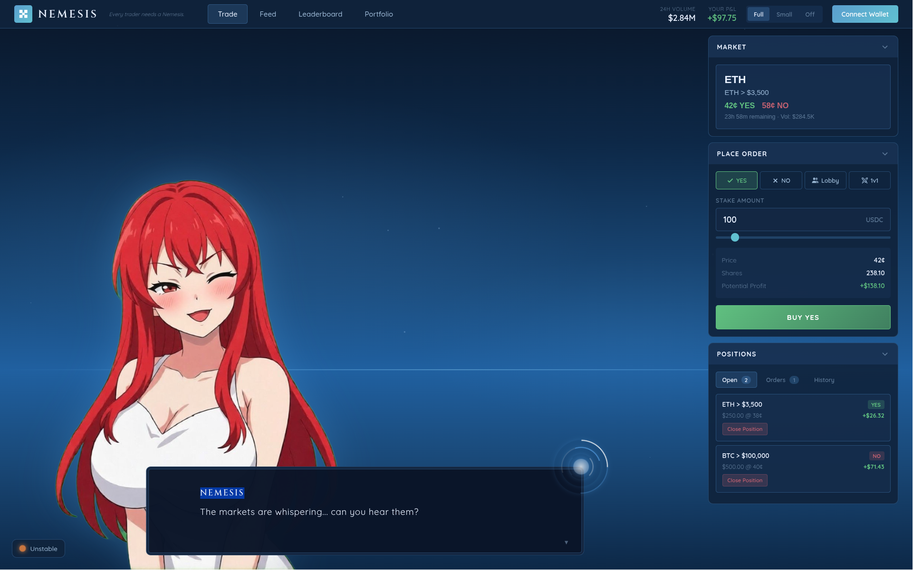

<div align="center">

# NEMESIS

*Every trader needs a Nemesis.*

**[nemesis.london](https://nemesis.london)**




*Visual novel-inspired battle trading interface for the Hyperliquid London Community Hackathon 2026*

</div>

---

## Quick Start

### Development

```bash
nix run .#dev
```

With debug logging:

```bash
DEBUG=1 nix run .#dev
```

### Build

```bash
nix run .#build
```

### Deploy

```bash
nix run .#ship
```

---

## How It Works

The entire workflow is driven by `flake.nix`. There are no npm scripts, no separate build tools, no configuration drift between environments.

### The Nix Flake

```
flake.nix
├── .#dev     → serve.dev.ts    → Development server with HMR
├── .#build   → serve.prod.ts   → Single binary production build
└── .#ship    → serve.prod.ts   → Deploy to production
```

### The Bun Serve Trifecta

Three files handle all server modes:

| File | Purpose | Invoked By |
|------|---------|------------|
| `serve.dev.ts` | Development server with hot module reload of CSS (and only CSS, purposefully), source maps, verbose logging optionality | `nix run .#dev` |
| `serve.prod.ts` | Production server compiled to single binary executable for Arch Linux architecture VPS | `nix run .#build`, `nix run .#ship` |
| `serve.shared.ts` | Shared configuration to deduplicate common functionality, routes, middleware, miscellaneous | Both |

### Why This Structure

**Single binary in dev**: `nix run .#dev` compiles and runs a single binary, identical to production. This allows what you test locally to be uniform with what eventually ships and reduce testing requirements.

**Reproducible builds**: Nix ensures every developer and CI system builds the exact same artifact. No "works on my machine" issues. Full compatibility with any machine running nix (Windows (WSL), MacOS, Linux)

**No intermediate steps**: Clone → `nix run .#dev` → working. No `npm install`, no `bun install`, no setup scripts. Flake incorporates bun install. Lock files can be deleted for updated versions of software but repository will always run without fail thanks to pinning of software package versioning.

### Environment Variables

```bash
cp .env.template .env
```

Required variables are documented in `.env.template`. The template is committed; the actual `.env` is gitignored.

---

## Project Structure

```
.
├── app/                    # Core application modules
│   ├── app.ts              # Main app initialization
│   ├── audio.ts            # Sound effects & music
│   ├── connection.ts       # WebSocket/RPC connections
│   ├── dialogue.ts         # Visual novel dialogue system
│   ├── events.ts           # Event handling
│   ├── icons.ts            # Icon assets
│   ├── render.ts           # DOM rendering (morphdom)
│   ├── signal.ts           # Reactive state signals
│   ├── state.ts            # Global state management
│   ├── storage.ts          # Local storage persistence
│   ├── types.ts            # TypeScript definitions
│   ├── utils.ts            # Utility functions
│   └── wallet.ts           # Wallet integration
├── config/                 # Configuration modules
│   ├── chains.ts           # Chain definitions
│   ├── env.ts              # Environment variables
│   ├── index.ts            # Config exports
│   └── wagmi.ts            # Wagmi configuration
├── css/                    # Stylesheets
│   ├── avatar.css          # Character avatars
│   ├── backgrounds.css     # Background images
│   ├── base.css            # Base styles
│   ├── connection.css      # Connection UI
│   ├── crt.css             # CRT monitor effect
│   ├── dialogue.css        # Dialogue boxes
│   ├── header.css          # Header component
│   ├── pages.css           # Page layouts
│   ├── panels.css          # UI panels
│   ├── responsive.css      # Mobile responsiveness
│   ├── title.css           # Title screen
│   └── utils.css           # Utility classes
├── dist/                   # Build output
├── documentation/          # Docs & assets
│   ├── nemesis-whitepaper.pdf
│   ├── nemesis-whitepaper.tex
│   ├── pitchdeck/          # Pitch deck slides
│   └── screenshot.png
├── fonts/                  # Custom fonts
│   ├── Cinzel/
│   └── Quicksand/
├── nemesis-chan/           # Character expressions
│   ├── concerned.png
│   ├── excited.png
│   ├── happy.png
│   ├── inquisitive.png
│   ├── kawaii.png
│   ├── loss.png
│   ├── pleased.png
│   ├── sly.png
│   └── talkative.png
├── app.ts                  # Entry point
├── index.html              # HTML shell
├── style.css               # Root stylesheet
├── flake.nix               # Nix flake (build system)
├── flake.lock              # Nix lock file
├── package.json            # Dependencies
├── tsconfig.json           # TypeScript config
├── serve.dev.ts            # Dev server
├── serve.prod.ts           # Prod server
├── serve.shared.ts         # Shared server config
└── sw.template.js          # Service worker template
```

---

## Technology Stack

| Component | Technology |
|-----------|------------|
| Runtime | Bun |
| Build | Nix Flakes |
| DOM | morphdom |
| Wallet | viem + @wagmi/core |
| Mobile | WalletConnect v2 |
| Cross-Chain Routing | @lifi/sdk |
| Pair Trading | Pear Protocol API |
| Treasury Coordination | salt-sdk |
| Liquid Staking | Valantis stHYPE |
| Price Feeds | HyperCore Oracle |
| Trade Ledger | Hyperliquid Info API |

---

## Documentation

| Document | Description |
|----------|-------------|
| [Whitepaper](documentation/nemesis-whitepaper.pdf) | Product vision, architecture, hackathon scope |

---

## Hackathon Tracks

This submission targets five sponsor tracks simultaneously:

| Track | Sponsor | Integration |
|-------|---------|-------------|
| Cross-Chain Onboarding | LI.FI | Multi-chain routing to swap and bridge into HyperEVM |
| Liquid Staking | Valantis | stHYPE liquid staking for protocol treasury yield |
| Pair Trading | Pear Protocol | Non-custodial pair and basket trading via Execution API |
| Treasury Coordination | Salt | Self-custodial policy-controlled Robo Managers for trading guilds |
| Trade Ledger API | Insilico | Trade history, position tracking, P&L, leaderboards |

---

## Chain Configuration

| Network | Chain ID | RPC |
|---------|----------|-----|
| HyperEVM Mainnet | 999 | `https://rpc.hyperliquid.xyz/evm` |
| HyperEVM Testnet | 998 | `https://rpc.hyperliquid-testnet.xyz/evm` |
| Arbitrum (Salt Orchestration) | 42161 | `https://arb1.arbitrum.io/rpc` |

---

## License

Copyright © 2026 Oscar Allgrove-Ralph, Enzo Joly & ENZOJOLY Ltd.

Licensed under [PolyForm Noncommercial 1.0.0](LICENSE). You may view, learn from, and use this software for noncommercial purposes. Commercial use requires explicit written permission.

---

<div align="center">

**[nemesis.london](https://nemesis.london)**

*Built for the Hyperliquid London Community Hackathon 2026*

</div>
